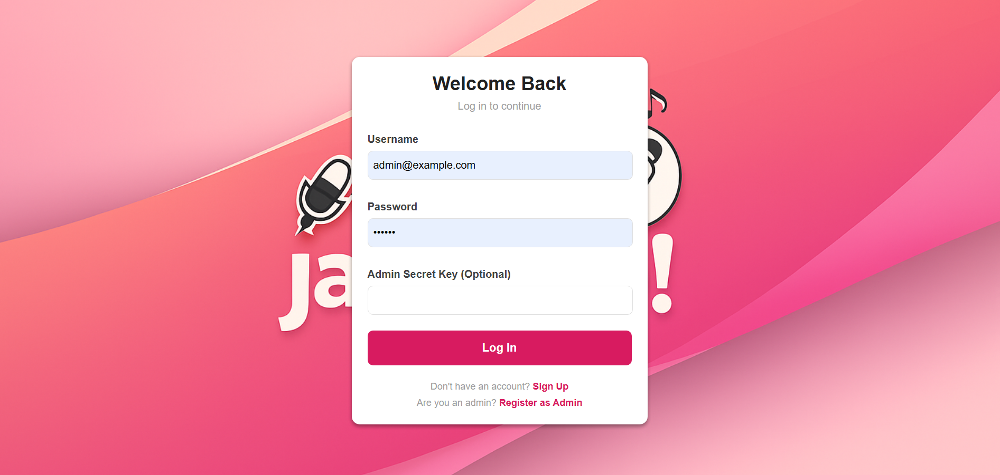
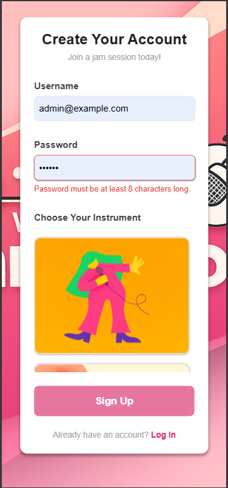
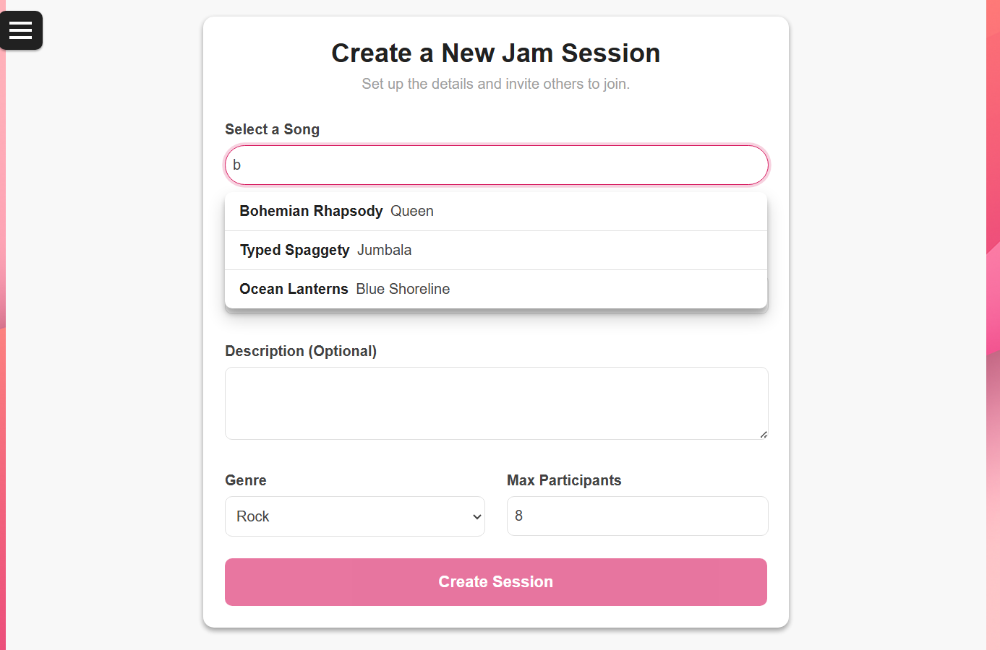
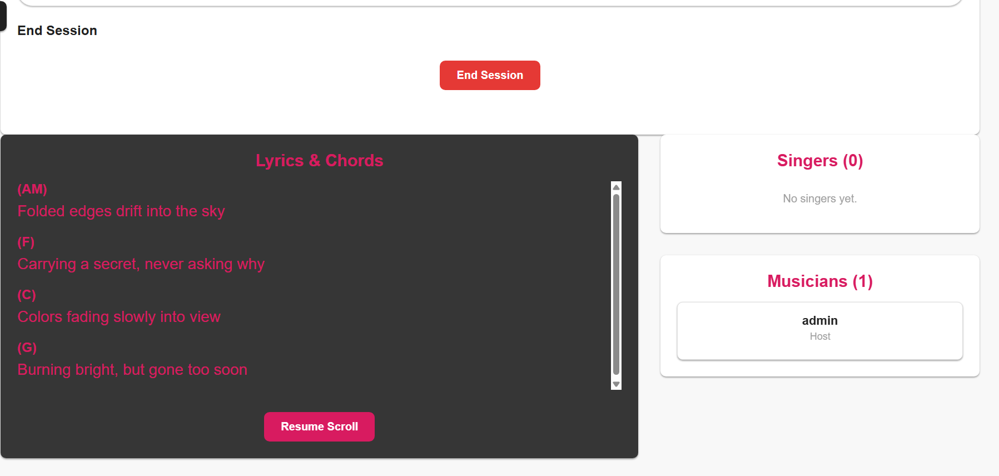
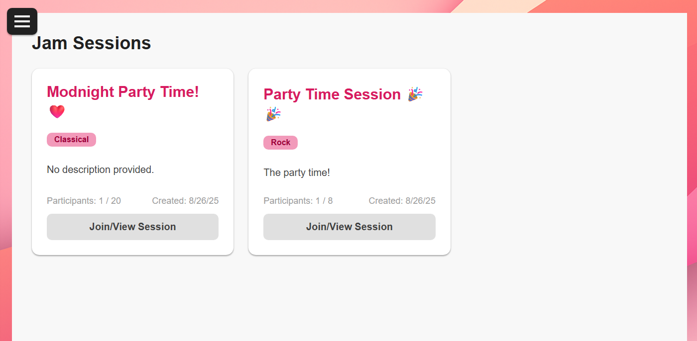

# JaMoveo: Real-time Rehearsal Management App


A real-time rehearsal management application built with Angular (Frontend) and Node.js (Backend) using Socket.IO for live communication.
JaMoveo helps musicians and singers manage jam sessions, share lyrics and chords, and collaborate in real-time.

# See the app in action Here 👇

https://jamoveo-u4i1.onrender.com

## Table of Contents

-   [Features](#features)
-   [Technologies Used](#technologies-used)
-   [Screenshots](#screenshots)
-   [Getting Started (For Developers)](#getting-started)
    -   [Prerequisites](#prerequisites)
    -   [Supabase Setup](#supabase-setup)
    -   [Backend Setup](#backend-setup)
    -   [Frontend Setup](#frontend-setup)
    -   [Running the Application](#running-the-application)
-   [Usage](#usage)

## Features

-   **Real-time Session Management**: Create, join, and end jam sessions in real-time.
-   **Participant Tracking**: See who's joined a session and their instrument.
-   **Live Lyrics & Chords**: Synchronized display of lyrics and chords for the current song.
-   **Song Search & Selection**: Admins can search for songs and change the active song for the session.
-   **User Authentication**: Secure login and registration for musicians and admins.
-   **Role-Based Access Control**: Differentiate between regular users and administrators.
-   **Responsive Design**: Optimized for various screen sizes.

## Technologies Used

### Frontend
-   Angular (v17+)
-   TypeScript
-   SCSS
-   Socket.IO Client

### Backend
-   Angular.js
-   Node.js
-   Express.js
-   TypeScript
-   Socket.IO
-   Supabase (for Database & Authentication)

## Screenshots

Example:






## Getting Started (For Developers)

Follow these instructions to set up and run the project locally.

### Prerequisites

-   Node.js (v18 or higher)
-   npm (Node Package Manager)
-   A Supabase project (for database and authentication)

### Supabase Setup

1.  **Create a Supabase Project**: Go to [Supabase](https://supabase.com/) and create a new project.
2.  **Database Schema**: Apply the schema from `supabase_schema.sql` to your Supabase project. This file contains the necessary table definitions for users, sessions, participants, and songs.
3.  **Environment Variables**:
    *   Create a `.env` file in the `server/` directory and add your Supabase project URL and Service Role Key:
        ```
        SUPABASE_URL="YOUR_SUPABASE_URL"
        SUPABASE_SERVICE_ROLE_KEY="YOUR_SUPABASE_SERVICE_ROLE_KEY"
        JWT_SECRET="A_STRONG_RANDOM_SECRET_KEY_FOR_JWT"
        ```
    *   Create a `.env` file in the `client/` directory (if needed for client-side Supabase keys, though currently not directly used for Supabase client in frontend, but good practice for future expansion).

### Backend Setup

1.  Navigate to the `server/` directory:
    ```bash
    cd server
    ```
2.  Install dependencies:
    ```bash
    npm install
    ```

### Frontend Setup

1.  Navigate to the `client/` directory:
    ```bash
    cd client
    ```
2.  Install dependencies:
    ```bash
    npm install
    ```

### Running the Application

1.  **Start the Backend Server**:
    From the `server/` directory:
    ```bash
    npm start
    ```
    The backend server will run on `http://localhost:3000`.

2.  **Start the Frontend Application**:
    From the `client/` directory:
    ```bash
    npm start
    ```
    The Angular application will typically open in your browser at `http://localhost:4200`.

## Usage

-   **Register**: Create a new user account. Admins can register via `/admin/signup` with a secret key.
-   **Login**: Log in with your credentials.
-   **Create Session (Admin)**: Admins can create new jam sessions, selecting a song to start with.
-   **Join Session**: Users can join existing public sessions.
-   **Live View**: Participate in real-time sessions, see other participants, and view synchronized lyrics/chords.
-   **Change Song (Admin)**: Admins can search for and change the current song during a live session.
-   **End Session (Admin)**: Admins can end a session, which will redirect all participants.
